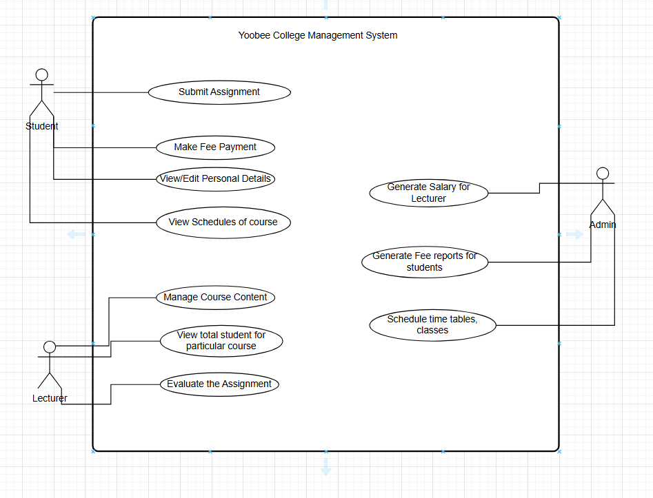

Project scope:

Yoobee college need to build the database for managing academic and administration data.
The database should have the all the details about the  students, lecturers, course detials, fee structure.
The purpose of the database is to reduce redundancy,and provide accurate information.

Main Entities and Their Roles:

1.   Student
Represents individuals enrolled at Yoobee College.

Attributes: Student_Id (PK), First_Name, Last_Name, Date_Of_Birth, Course_Id (FK), Lecturer_ID (FK)

2.Lecturer
Represents teaching staff responsible for delivering courses.

Attributes: Lecturer_ID (PK), Course_Id (FK), First_Name, Last_Name, Date_Of_Birth

3.Course
Represents academic courses offered by the college.

Attributes: Course_ID (PK), Course_Name, Credits, Department_ID

4. Fee
Represents academic fee details and due payments for each student.

Attributes: Fee_Id (PK), Course_Id (FK), Total_Fee, Due_Date

Actors:
1.Student
2.Lecturer
3.Admin

Use Cases:
1. Student->View /edit personal detials
        ->view the schedules for the course/timetable
        --> make fee payment
        ->Submit Assignment
2. Lecture-> Manage  course content
        ->See the total students for the particular course
        ->Evaluate the assignment
       
3. Admin-> schedules time table and  class room
        ->Generate fee reports for students
        -> Generate salary for lecturer
USe case
